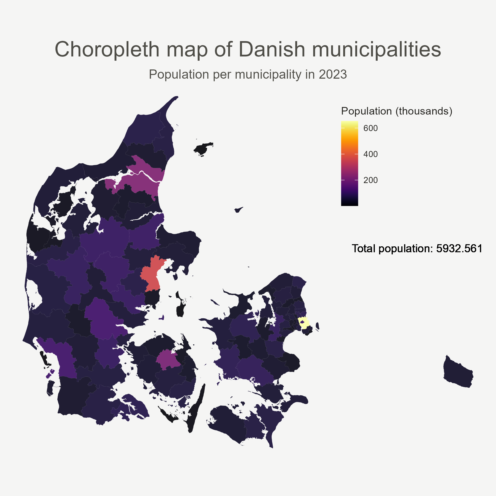

# Visualizing three decades of urbanization in Denmark

**Abstract:** This project examines the urbanization process in Denmark over the past three decades using spatial analysis and visualization techniques. Municipal population data and topographical features are utilized to create altered maps that depict the changes in urbanization patterns. Choropleth maps and cartograms represent population distribution and size, while a time series approach visualizes the changes over time. The findings highlight population concentration around major cities like Copenhagen, Aarhus, Odense, and Aalborg, emphasizing the dominance of Copenhagen. The visualizations provide insights into a process of ongoing, moderate
urbanization in Denmark.

**Keywords**: spatial analytics, urbanization, cartogram, choropleth, time series

**Link to GitHub repository:** https://github.com/alekswael/visualizing-urbanization

# Visualizations

*Animated cartogram/choropleth map of Danish municipalities. Population per municipality in the years 1993-2023.*

*Choropleth map of Danish municipalities, colored by total population ratio, using data from year 2023.*
